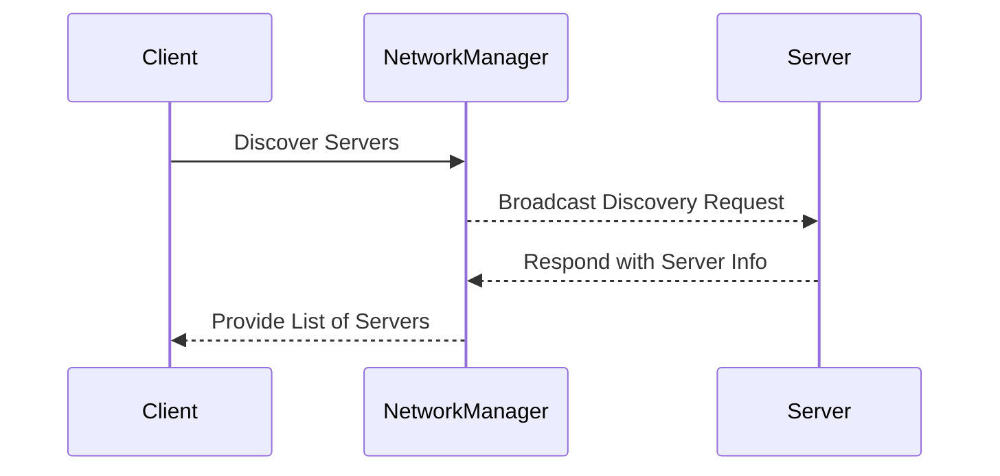
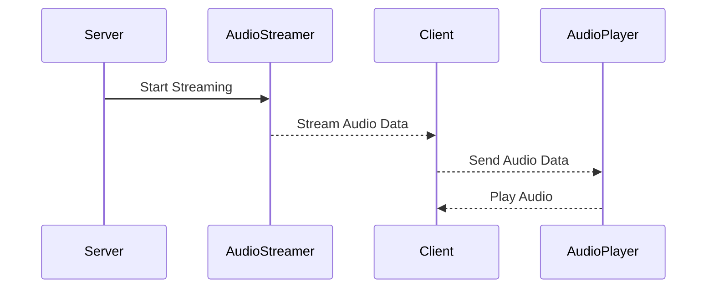
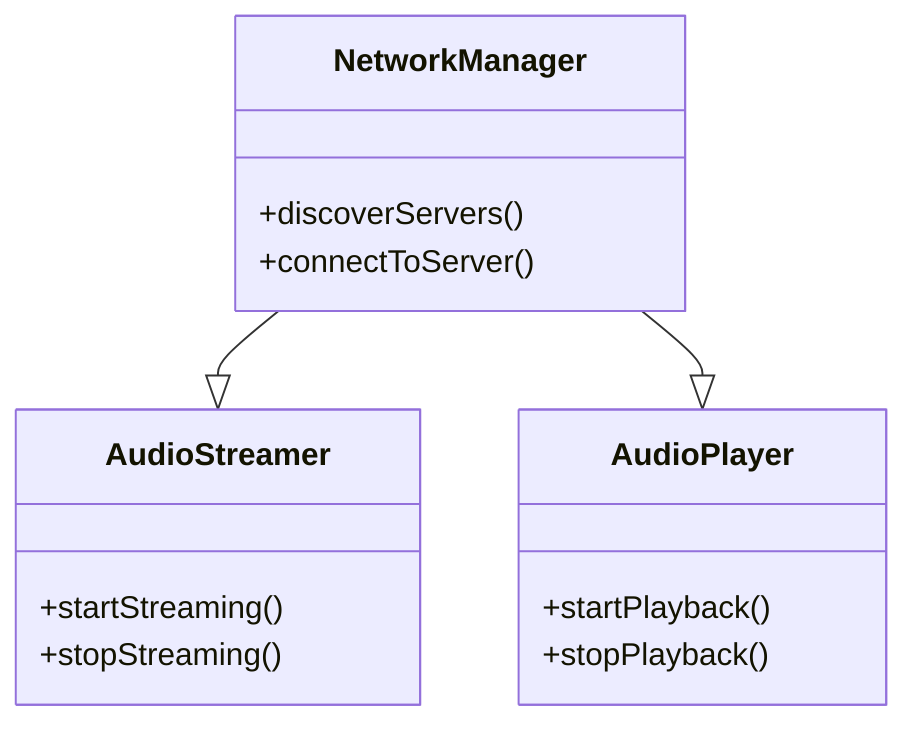

 Here are the diagrams to be included in the `README.md`:

### Network Discovery Process


### Audio Streaming Process


### Component Interaction Diagram


### Updated README.md with Diagrams

```markdown
# Blueline Audio Streamer

## Project Overview
Blueline is an audio streaming application developed using the Qt6 framework. It operates in both server and client modes, allowing for audio streaming and playback across networks.

## Features
- **Network Discovery**: Automatically discovers devices on the network.
- **Audio Streaming**: Streams audio data from server to client.
- **Audio Playback**: Plays received audio streams on the client.
- **User Interface**: Provides an intuitive interface for controlling streaming and playback.

## Installation

### Prerequisites
- Qt6 Framework
- C++17 compatible compiler
- CMake

### Setup
1. Clone the repository:
    ```bash
    git clone https://github.com/sparesparrow/blueline.git
    cd blueline
    ```

2. Build the project:
    ```bash
    mkdir build
    cd build
    cmake ..
    make
    ```

3. Run the application:
    ```bash
    ./Blueline
    ```

## Usage

### Running the Server
1. Launch the application.
2. Select "Server Mode".
3. Click "Start Streaming".

### Running the Client
1. Launch the application.
2. Select "Client Mode".
3. Click "Discover" to find available servers.
4. Select a server and click "Start Playback".

## Components

### NetworkManager
- Handles network-related tasks including discovery and connection management.

### AudioStreamer
- Manages the streaming of audio data from the server.

### AudioPlayer
- Responsible for playback of audio streams on the client side.

## Diagrams

### Network Discovery Process


### Audio Streaming Process


### Component Interaction Diagram


## Future Enhancements
- **Error Handling**: Improve error messages and logging.
- **User Interface**: Enhance the UI for better user experience.
- **Security**: Implement encryption for audio streams and authentication for connections.
- **Advanced Network Discovery**: Enhance discovery mechanisms for better performance.

## Contribution
Feel free to fork the repository, make improvements, and submit pull requests.

## License
This project is licensed under the MIT License.