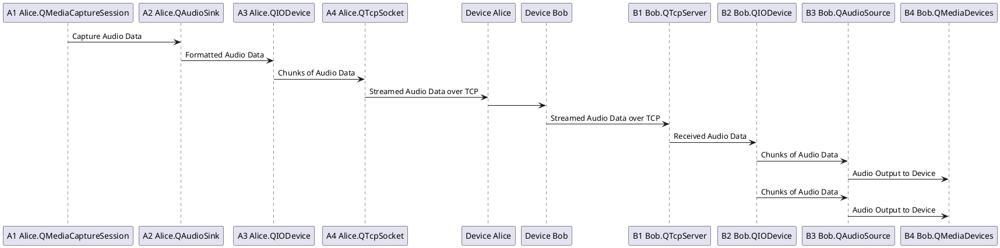

```plantuml
@startuml
participant "A1 Alice.QMediaCaptureSession" as A1
participant "A2 Alice.QAudioSink" as A2
participant "A3 Alice.QIODevice" as A3

participant "A4 Alice.QTcpSocket" as A4

participant "Device Alice" as A
participant "Device Bob" as B

participant "B1 Bob.QTcpServer" as B1

participant "B2 Bob.QIODevice" as B2
participant "B3 Bob.QAudioSource" as B3
participant "B4 Bob.QMediaDevices" as B4

A1 -> A2: Capture Audio Data
A2 -> A3: Formatted Audio Data

A3 -> A4: Chunks of Audio Data
A4 -> A: Streamed Audio Data over TCP

A -> B

B -> B1: Streamed Audio Data over TCP
B1 -> B2: Received Audio Data

B2 -> B3: Chunks of Audio Data
B3 -> B4: Audio Output to Device


B2 -> B3: Chunks of Audio Data
B3 -> B4: Audio Output to Device
@enduml
```