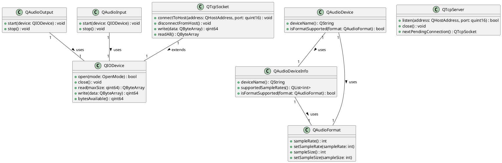

```puml
@startuml

class QIODevice {
   +open(mode: OpenMode) : bool
   +close() : void
   +read(maxSize: qint64) : QByteArray
   +write(data: QByteArray) : qint64
   +bytesAvailable() : qint64
}

class QAudioDevice {
   +deviceName() : QString
   +isFormatSupported(format: QAudioFormat) : bool
}

class QAudioDeviceInfo {
   +deviceName() : QString
   +supportedSampleRates() : QList<int>
   +isFormatSupported(format: QAudioFormat) : bool
}

QAudioDevice "1" -- "1" QAudioDeviceInfo : uses >

class QAudioFormat {
   +sampleRate() : int
   +setSampleRate(sampleRate: int)
   +sampleSize() : int
   +setSampleSize(sampleSize: int)
}

QAudioDevice "1" -- "1" QAudioFormat : uses >
QAudioDeviceInfo "1" -- "1" QAudioFormat : uses >

class QAudioOutput {
   +start(device: QIODevice) : void
   +stop() : void
}

class QAudioInput {
   +start(device: QIODevice) : void
   +stop() : void
}

QAudioOutput "1" -- "1" QIODevice : uses >
QAudioInput "1" -- "1" QIODevice : uses >

class QTcpSocket {
   +connectToHost(address: QHostAddress, port: quint16) : void
   +disconnectFromHost() : void
   +write(data: QByteArray) : qint64
   +readAll() : QByteArray
}

QTcpSocket "1" -- "1" QIODevice : extends >

class QTcpServer {
   +listen(address: QHostAddress, port: quint16) : bool
   +close() : void
   +nextPendingConnection() : QTcpSocket
}

@enduml
```